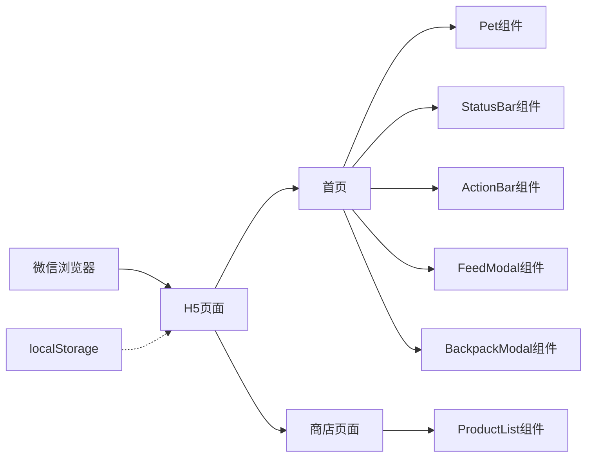

# 微信公众号桌宠开发文档

---

## 1. 技术架构设计

### 1.1 整体架构



### 1.2 技术栈

| 分类 | 技术 | 版本 | 说明 |
|------|------|------|------|
| 前端框架 | React | 18.x | UI框架 |
| 构建工具 | Vite | 6.x | 快速构建 |
| 样式 | TailwindCSS | 3.x | CSS框架 |
| 图标 | Lucide React | latest | SVG图标库 |
| 状态管理 | React Hooks | built-in | useState/useEffect |
| 数据持久化 | localStorage | - | 浏览器本地存储 |

### 1.3 核心架构原则

1. **组件化**: 拆分独立功能组件，提高复用性
2. **响应式**: 优先移动端适配
3. **性能优化**: 使用CSS动画、GPU加速
4. **微信兼容**: 处理微信浏览器特殊行为

---

## 2. 文件结构

```
src/
├── components/           # 组件目录
│   ├── Pet/             # 桌宠组件
│   │   ├── index.tsx
│   │   └── styles.css
│   ├── StatusBar/       # 状态栏组件
│   │   ├── index.tsx
│   │   └── styles.css
│   ├── ActionBar/       # 操作栏组件
│   │   ├── index.tsx
│   │   └── styles.css
│   ├── ProductList/     # 商品列表组件
│   │   ├── index.tsx
│   │   └── styles.css
│   ├── FeedModal/       # 喂食弹窗组件
│   │   ├── index.tsx
│   │   └── styles.css
│   ├── BackpackModal/   # 背包弹窗组件
│   │   ├── index.tsx
│   │   └── styles.css
│   └── PetSelect/       # 宠物选择组件
│       ├── index.tsx
│       └── styles.css
├── hooks/               # 自定义Hooks
│   ├── usePetState.ts   # 宠物状态管理
│   ├── useDraggable.ts  # 拖拽交互
│   └── useStorage.ts    # localStorage封装
├── data/                # 数据文件
│   └── products.ts      # 商品数据
├── types/               # TypeScript类型定义
│   └── index.ts         # 类型声明
├── utils/               # 工具函数
│   └── helpers.ts       # 辅助函数
├── pages/               # 页面
│   ├── Home.tsx         # 首页
│   └── Shop.tsx         # 商店页
├── App.tsx              # 应用入口
├── main.tsx             # 主入口
└── index.css            # 全局样式
```

---

## 3. 数据模型

### 3.1 类型定义

```typescript
// types/index.ts

export type PetType = 'cat' | 'dog';

export interface PetConfig {
  id: PetType;
  name: string;
  emoji: string;
  color: string;
  favoriteFood: string;
}

export interface PetState {
  type: PetType;
  hunger: number;      // 0-100
  mood: number;        // 0-100
  coins: number;       // 金币数量
  position: { x: number; y: number };
}

export interface Product {
  id: string;
  name: string;
  emoji: string;
  price: number;
  category: 'food' | 'toy' | 'decoration';
  effect: {
    hunger?: number;
    mood?: number;
  };
  applicablePets: PetType[];
}

export interface BackpackItem {
  productId: string;
  quantity: number;
}

export interface GameState {
  pet: PetState;
  backpack: BackpackItem[];
  lastFeedTime: number;
  lastPlayTime: number;
}
```

### 3.2 宠物配置数据

| 宠物类型 | name | emoji | color | favoriteFood |
|----------|------|-------|-------|--------------|
| cat | 小橘 | 🐱 | #FFB347 | 鱼🐟 |
| dog | 旺财 | 🐕 | #8B4513 | 骨头🍖 |

### 3.3 商品数据

| id | name | emoji | price | category | effect | applicablePets |
|----|------|-------|-------|----------|--------|----------------|
| fish | 小鱼干 | 🐟 | 10 | food | {hunger: 20} | ['cat'] |
| cat-food | 猫粮 | 🍚 | 20 | food | {hunger: 40} | ['cat'] |
| cat-can | 高级罐头 | 🥫 | 50 | food | {hunger: 80} | ['cat'] |
| bone | 骨头 | 🍖 | 10 | food | {hunger: 20} | ['dog'] |
| dog-food | 狗粮 | 🍖 | 20 | food | {hunger: 40} | ['dog'] |
| dog-can | 肉罐头 | 🥫 | 50 | food | {hunger: 80} | ['dog'] |
| feather | 逗猫棒 | 🪶 | 30 | toy | {mood: 30} | ['cat'] |
| ball | 小球 | ⚽ | 30 | toy | {mood: 30} | ['dog'] |
| love | 爱心 | ❤️ | 100 | toy | {hunger: 50, mood: 50} | ['cat', 'dog'] |

### 3.4 初始状态

```typescript
const initialState: GameState = {
  pet: {
    type: 'cat',
    hunger: 70,
    mood: 80,
    coins: 100,
    position: { x: 50, y: 50 }
  },
  backpack: [],
  lastFeedTime: Date.now(),
  lastPlayTime: Date.now()
};
```

---

## 4. 核心功能实现

### 4.1 宠物状态管理

#### 4.1.1 饥饿值和心情值逻辑

```typescript
// hooks/usePetState.ts

// 饥饿值递减：每分钟减少1
const HUNGER_DECREASE_RATE = 1 / 60; // 每秒减少量

// 心情值影响因子
const MOOD_AFFECT_HUNGRY = 0.5;    // 饥饿时心情下降加快
const MOOD_RECOVER_RATE = 0.1;     // 饱腹时心情恢复速率

// 更新状态
function updateState(state: GameState): GameState {
  const now = Date.now();
  const timeDelta = (now - state.lastFeedTime) / 1000; // 秒
  
  let newHunger = Math.max(0, state.pet.hunger - HUNGER_DECREASE_RATE * timeDelta);
  let newMood = state.pet.mood;
  
  // 根据饥饿值影响心情
  if (newHunger < 30) {
    newMood = Math.max(0, newMood - MOOD_AFFECT_HUNGRY * timeDelta);
  } else if (newHunger > 70) {
    newMood = Math.min(100, newMood + MOOD_RECOVER_RATE * timeDelta);
  }
  
  return {
    ...state,
    pet: {
      ...state.pet,
      hunger: Math.round(newHunger),
      mood: Math.round(newMood)
    },
    lastFeedTime: now
  };
}
```

### 4.2 拖拽交互

#### 4.2.1 触摸事件处理

```typescript
// hooks/useDraggable.ts

interface DraggableState {
  isDragging: boolean;
  position: { x: number; y: number };
}

function useDraggable(initialPosition: { x: number; y: number }) {
  const [state, setState] = useState<DraggableState>({
    isDragging: false,
    position: initialPosition
  });
  
  const offset = useRef({ x: 0, y: 0 });
  
  const handleTouchStart = (e: TouchEvent) => {
    const touch = e.touches[0];
    offset.current = {
      x: touch.clientX - state.position.x,
      y: touch.clientY - state.position.y
    };
    setState(prev => ({ ...prev, isDragging: true }));
  };
  
  const handleTouchMove = (e: TouchEvent) => {
    if (!state.isDragging) return;
    
    const touch = e.touches[0];
    const newX = touch.clientX - offset.current.x;
    const newY = touch.clientY - offset.current.y;
    
    // 边界限制
    const maxX = window.innerWidth - PET_WIDTH;
    const maxY = window.innerHeight - PET_HEIGHT - ACTION_BAR_HEIGHT;
    
    setState(prev => ({
      ...prev,
      position: {
        x: Math.max(0, Math.min(maxX, newX)),
        y: Math.max(STATUS_BAR_HEIGHT, Math.min(maxY, newY))
      }
    }));
  };
  
  const handleTouchEnd = () => {
    setState(prev => ({ ...prev, isDragging: false }));
  };
  
  return {
    ...state,
    handlers: {
      onTouchStart: handleTouchStart,
      onTouchMove: handleTouchMove,
      onTouchEnd: handleTouchEnd
    }
  };
}
```

### 4.3 商店购买流程

```typescript
// pages/Shop.tsx

interface PurchaseResult {
  success: boolean;
  message: string;
}

function purchaseProduct(productId: string, state: GameState): PurchaseResult {
  const product = products.find(p => p.id === productId);
  if (!product) return { success: false, message: '商品不存在' };
  
  if (state.pet.coins < product.price) {
    return { success: false, message: '金币不足' };
  }
  
  // 检查是否适用当前宠物
  if (!product.applicablePets.includes(state.pet.type)) {
    return { success: false, message: '此商品不适合您的宠物' };
  }
  
  // 扣除金币
  const newCoins = state.pet.coins - product.price;
  
  // 添加到背包
  const existingItem = state.backpack.find(item => item.productId === productId);
  let newBackpack;
  
  if (existingItem) {
    newBackpack = state.backpack.map(item =>
      item.productId === productId
        ? { ...item, quantity: item.quantity + 1 }
        : item
    );
  } else {
    newBackpack = [...state.backpack, { productId, quantity: 1 }];
  }
  
  // 保存状态
  saveState({
    ...state,
    pet: { ...state.pet, coins: newCoins },
    backpack: newBackpack
  });
  
  return { success: true, message: '购买成功！' };
}
```

### 4.4 喂食功能

```typescript
// hooks/usePetState.ts

function feedPet(productId: string, state: GameState): GameState | null {
  const item = state.backpack.find(item => item.productId === productId);
  if (!item || item.quantity <= 0) return null;
  
  const product = products.find(p => p.id === productId);
  if (!product) return null;
  
  // 计算新状态
  const newHunger = Math.min(100, state.pet.hunger + (product.effect.hunger || 0));
  const newMood = Math.min(100, state.pet.mood + (product.effect.mood || 0));
  
  // 更新背包
  const newBackpack = state.backpack.map(item =>
    item.productId === productId
      ? { ...item, quantity: item.quantity - 1 }
      : item
  ).filter(item => item.quantity > 0);
  
  return {
    ...state,
    pet: {
      ...state.pet,
      hunger: newHunger,
      mood: newMood
    },
    backpack: newBackpack,
    lastFeedTime: Date.now()
  };
}
```

---

## 5. 页面与组件说明

### 5.1 首页 (Home)

**功能**: 展示宠物、状态、操作按钮

**组件结构**:
```
Home
├── StatusBar (顶部固定)
│   ├── 宠物头像/名称
│   ├── 饥饿值进度条
│   └── 心情值进度条
├── Pet (可拖拽)
│   ├── 宠物表情显示
│   ├── 漂浮动画
│   └── 交互区域
└── ActionBar (底部固定)
    ├── 喂食按钮
    ├── 玩耍按钮
    ├── 商店按钮
    └── 背包按钮
```

### 5.2 商店页面 (Shop)

**功能**: 商品展示与购买

**组件结构**:
```
Shop
├── Header
│   ├── 返回按钮
│   ├── 标题
│   └── 金币显示
├── CategoryTabs (横向滚动)
│   ├── 食物
│   ├── 道具
│   └── 装饰
└── ProductList (网格布局)
    ├── ProductCard
    │   ├── 商品图标
    │   ├── 商品名称
    │   ├── 价格
    │   └── 购买按钮
    └── ...
```

### 5.3 宠物组件 (Pet)

**功能**: 宠物展示与交互

**状态**:
| 状态 | 条件 | 表情 | 动画 |
|------|------|------|------|
| 开心 | hunger>70 && mood>70 | 😊 | 漂浮 + 随机眨眼 |
| 正常 | hunger 30-70 && mood 30-70 | 😐 | 漂浮 |
| 难过 | hunger<30 && mood<30 | 😢 | 饥饿抖动 |
| 困惑 | hunger>70 && mood<30 | 😕 | 漂浮 |
| 饥饿但开心 | hunger<30 && mood>70 | 🤤 | 饥饿抖动 + 偶尔开心 |

**动画效果**:
- **漂浮**: CSS Keyframes 上下浮动
- **眨眼**: 随机触发眼睛闭合
- **跳动**: 点击时向上跳跃
- **饥饿抖动**: 肚子收缩动画

---

## 6. localStorage 存储方案

### 6.1 存储结构

```typescript
interface StoredData {
  petType: PetType;
  hunger: number;
  mood: number;
  coins: number;
  position: { x: number; y: number };
  backpack: BackpackItem[];
  lastUpdateTime: number;
}
```

### 6.2 存储键名

```typescript
const STORAGE_KEY = 'pet_desktop_pet_data';
```

### 6.3 读写方法

```typescript
// hooks/useStorage.ts

function loadState(): GameState {
  try {
    const stored = localStorage.getItem(STORAGE_KEY);
    if (stored) {
      const data = JSON.parse(stored);
      // 验证数据完整性
      if (validateData(data)) {
        return transformStoredData(data);
      }
    }
  } catch (e) {
    console.error('Failed to load state:', e);
  }
  return initialState;
}

function saveState(state: GameState): void {
  try {
    const data = transformToStoredData(state);
    localStorage.setItem(STORAGE_KEY, JSON.stringify(data));
  } catch (e) {
    console.error('Failed to save state:', e);
  }
}
```

---

## 7. 动画实现

### 7.1 CSS 动画定义

```css
/* src/components/Pet/styles.css */

@keyframes float {
  0%, 100% {
    transform: translateY(0);
  }
  50% {
    transform: translateY(-10px);
  }
}

@keyframes blink {
  0%, 90%, 100% {
    transform: scaleY(1);
  }
  95% {
    transform: scaleY(0.1);
  }
}

@keyframes bounce {
  0%, 100% {
    transform: translateY(0) scale(1);
  }
  50% {
    transform: translateY(-20px) scale(1.1);
  }
}

@keyframes shake {
  0%, 100% {
    transform: translateX(0);
  }
  25% {
    transform: translateX(-3px);
  }
  75% {
    transform: translateX(3px);
  }
}

@keyframes eat {
  0%, 100% {
    transform: scale(1);
  }
  50% {
    transform: scale(1.1);
  }
}

.pet-float {
  animation: float 3s ease-in-out infinite;
}

.pet-blink {
  animation: blink 4s ease-in-out infinite;
}

.pet-bounce {
  animation: bounce 0.5s ease-out;
}

.pet-shake {
  animation: shake 0.3s ease-in-out;
}

.pet-eat {
  animation: eat 0.3s ease-out;
}
```

### 7.2 动画触发逻辑

```typescript
// src/components/Pet/index.tsx

useEffect(() => {
  // 随机眨眼
  const blinkInterval = setInterval(() => {
    if (Math.random() > 0.7) {
      setIsBlinking(true);
      setTimeout(() => setIsBlinking(false), 200);
    }
  }, 3000);
  
  return () => clearInterval(blinkInterval);
}, []);

useEffect(() => {
  // 饥饿抖动
  if (pet.hunger < 30) {
    const shakeInterval = setInterval(() => {
      setIsShaking(true);
      setTimeout(() => setIsShaking(false), 300);
    }, 2000);
    return () => clearInterval(shakeInterval);
  }
}, [pet.hunger]);
```

---

## 8. 微信浏览器适配

### 8.1 页面头部配置

```html
<!-- index.html -->
<!DOCTYPE html>
<html lang="zh-CN">
<head>
  <meta charset="UTF-8">
  <meta name="viewport" content="width=device-width, initial-scale=1.0, maximum-scale=1.0, user-scalable=no">
  <meta name="apple-mobile-web-app-capable" content="yes">
  <meta name="apple-mobile-web-app-status-bar-style" content="black-translucent">
  <meta name="theme-color" content="#FFB347">
  <title>宠物桌宠</title>
</head>
```

### 8.2 CSS 兼容性处理

```css
/* src/index.css */

* {
  -webkit-touch-callout: none;
  -webkit-user-select: none;
  user-select: none;
  touch-action: manipulation;
}

.pet {
  -webkit-transform: translateZ(0);
  -webkit-backface-visibility: hidden;
  -webkit-perspective: 1000;
  will-change: transform;
}

button {
  -webkit-appearance: none;
  appearance: none;
  border: none;
  outline: none;
}
```

---

## 9. 错误处理与边界情况

### 9.1 数值边界检查

```typescript
// utils/helpers.ts

function clamp(value: number, min: number, max: number): number {
  return Math.min(max, Math.max(min, value));
}

function validatePetState(state: PetState): PetState {
  return {
    ...state,
    hunger: clamp(state.hunger, 0, 100),
    mood: clamp(state.mood, 0, 100),
    coins: Math.max(0, state.coins)
  };
}
```

### 9.2 拖拽边界限制

```typescript
// hooks/useDraggable.ts

const PET_WIDTH = 100;
const PET_HEIGHT = 100;
const STATUS_BAR_HEIGHT = 60;
const ACTION_BAR_HEIGHT = 80;

function getValidPosition(x: number, y: number): { x: number; y: number } {
  const maxX = window.innerWidth - PET_WIDTH;
  const maxY = window.innerHeight - PET_HEIGHT - ACTION_BAR_HEIGHT;
  
  return {
    x: clamp(x, 0, maxX),
    y: clamp(y, STATUS_BAR_HEIGHT, maxY)
  };
}
```

### 9.3 数据迁移

```typescript
// hooks/useStorage.ts

function transformStoredData(data: StoredData): GameState {
  // 处理旧版本数据
  return {
    pet: {
      type: data.petType || 'cat',
      hunger: data.hunger || 70,
      mood: data.mood || 80,
      coins: data.coins || 100,
      position: data.position || { x: 50, y: 50 }
    },
    backpack: data.backpack || [],
    lastFeedTime: data.lastUpdateTime || Date.now(),
    lastPlayTime: data.lastUpdateTime || Date.now()
  };
}
```

---

## 10. 开发与部署

### 10.1 开发命令

```bash
# 安装依赖
npm install

# 启动开发服务器
npm run dev

# 构建生产版本
npm run build

# 预览构建结果
npm run preview
```

### 10.2 构建配置

```javascript
// vite.config.ts

import { defineConfig } from 'vite';
import react from '@vitejs/plugin-react';

export default defineConfig({
  plugins: [react()],
  build: {
    outDir: 'dist',
    assetsDir: 'assets',
    sourcemap: false,
    minify: 'terser'
  }
});
```

### 10.3 部署要求

1. **HTTPS**: 微信公众号要求HTTPS访问
2. **域名备案**: 服务器域名需备案
3. **跨域配置**: 确保API无跨域问题

---

## 11. 测试要点

### 11.1 功能测试

| 测试项 | 测试方法 | 预期结果 |
|--------|----------|----------|
| 宠物选择 | 点击选择按钮 | 切换宠物类型 |
| 拖拽移动 | 触摸拖拽宠物 | 宠物跟随手指移动 |
| 喂食功能 | 点击喂食按钮选择食物 | 饥饿值增加，背包减少 |
| 玩耍功能 | 点击玩耍按钮 | 心情值增加，宠物动画 |
| 商店购买 | 点击商品购买 | 金币减少，背包增加 |
| 状态持久化 | 刷新页面 | 状态保持不变 |

### 11.2 边界测试

| 测试项 | 测试方法 | 预期结果 |
|--------|----------|----------|
| 饥饿值下限 | 等待饥饿值降至0 | 宠物显示难过表情 |
| 金币不足购买 | 金币少于商品价格 | 提示金币不足 |
| 拖拽边界 | 拖到屏幕边缘 | 宠物停留在边界内 |
| 不适用商品 | 给小猫买骨头 | 提示不适合当前宠物 |

### 11.3 兼容性测试

| 测试平台 | 测试要点 |
|----------|----------|
| 微信浏览器 | 所有功能正常 |
| Safari iOS | 触摸拖拽流畅 |
| Chrome Android | 动画流畅 |
| 桌面浏览器 | 鼠标拖拽支持 |

---

## 12. 代码安全性

### 12.1 安全注意事项

1. **XSS防护**: 使用React内置的XSS防护，避免使用dangerouslySetInnerHTML
2. **数据验证**: 对localStorage数据进行验证，防止篡改
3. **输入过滤**: 对用户输入进行过滤和转义
4. **敏感信息**: 不存储敏感信息，所有数据仅存储在客户端

### 12.2 数据验证示例

```typescript
// utils/helpers.ts

function validateStoredData(data: unknown): data is StoredData {
  if (typeof data !== 'object' || data === null) return false;
  
  const d = data as StoredData;
  return (
    typeof d.petType === 'string' && ['cat', 'dog'].includes(d.petType) &&
    typeof d.hunger === 'number' && d.hunger >= 0 && d.hunger <= 100 &&
    typeof d.mood === 'number' && d.mood >= 0 && d.mood <= 100 &&
    typeof d.coins === 'number' && d.coins >= 0 &&
    typeof d.position === 'object' && d.position !== null &&
    typeof d.position.x === 'number' &&
    typeof d.position.y === 'number'
  );
}
```
