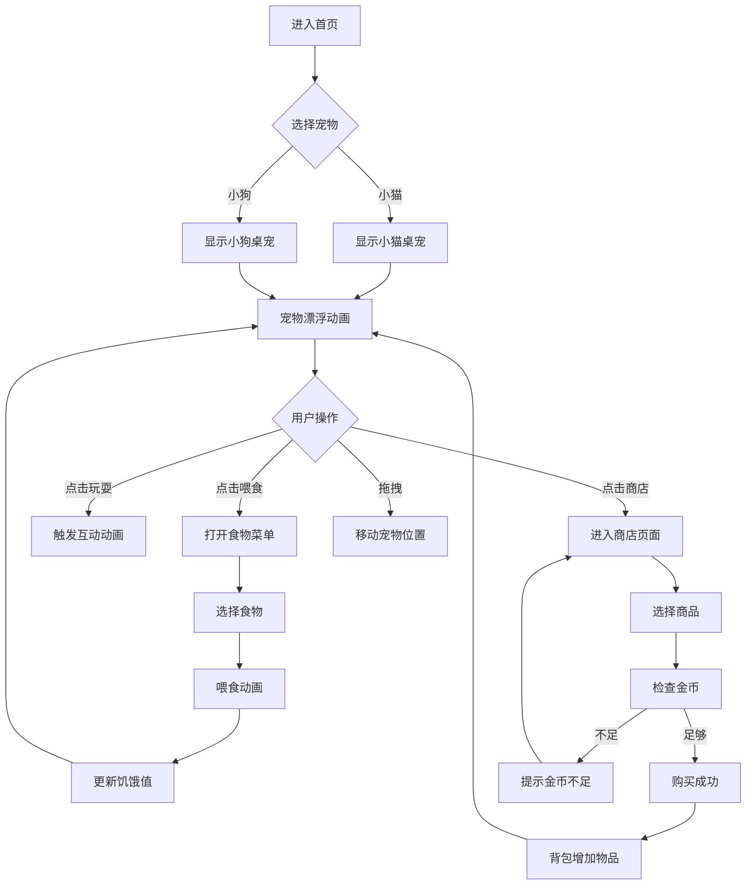
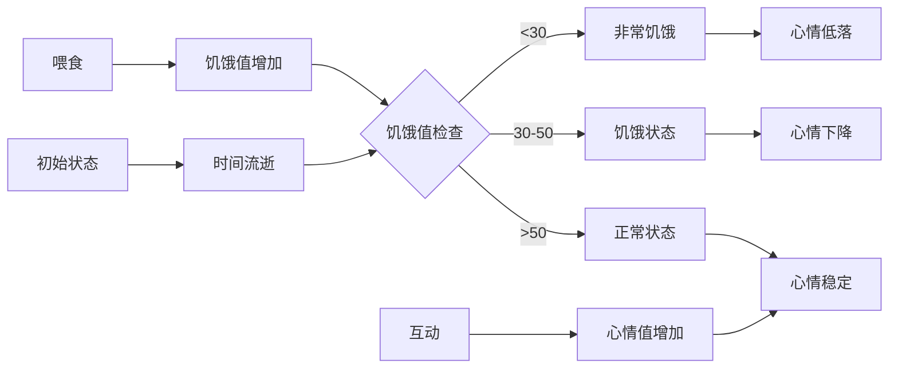

# 微信公众号桌宠产品需求文档

## 1. Product Overview

一款面向微信公众号用户的互动桌宠H5应用，用户可选择小猫或小狗作为宠物，通过喂食、互动来维持宠物的饥饿值和心情，还可通过商店购买食物和道具。

- **核心价值**: 为公众号增添趣味性和互动性，提升用户留存和活跃度
- **目标用户**: 微信公众号读者、宠物爱好者、年轻群体
- **使用场景**: 公众号文章阅读、空闲时间娱乐、社交分享

---

## 2. Core Features

### 2.1 Feature Module

1. **宠物选择**: 提供小猫和小狗两种角色选择
2. **状态系统**: 饥饿值和心情值的动态管理
3. **互动功能**: 点击互动、拖拽移动
4. **商店系统**: 购买食物和道具

### 2.2 Page Details

| Page Name | Module Name | Feature description |
|-----------|-------------|---------------------|
| 首页 | 宠物展示区 | 可拖拽的桌宠角色，显示当前状态 |
| 首页 | 状态面板 | 饥饿值和心情值进度条显示 |
| 首页 | 操作按钮 | 喂食、玩耍、商店入口 |
| 商店 | 商品列表 | 展示可购买的食物和道具 |
| 商店 | 购买流程 | 点击购买，扣除金币 |

### 2.3 功能详细说明

#### 2.3.1 宠物选择
| 属性 | 小猫 | 小狗 |
|------|------|------|
| 角色图标 | 🐱 | 🐕 |
| 主题颜色 | #FFB347 | #8B4513 |
| 喜爱食物 | 鱼🐟 | 骨头🍖 |
| 特殊技能 | 撒娇蹭人 | 摇尾巴 |

#### 2.3.2 状态系统
| 状态类型 | 范围 | 说明 |
|----------|------|------|
| 饥饿值 | 0-100 | 随时间递减，喂食增加 |
| 心情值 | 0-100 | 随饥饿值变化，互动增加 |

**状态影响关系**:
- 饥饿值 < 30 → 心情值下降速度加快
- 饥饿值 > 70 → 心情值缓慢恢复
- 频繁互动 → 心情值增加

#### 2.3.3 商店系统

| 商品分类 | 商品名称 | 价格 | 效果 |
|----------|----------|------|------|
| 食物 | 小鱼干🐟 | 10金币 | 饥饿值+20 |
| 食物 | 猫粮🍚 | 20金币 | 饥饿值+40 |
| 食物 | 高级罐头🥫 | 50金币 | 饥饿值+80 |
| 食物 | 骨头🍖 | 10金币 | 饥饿值+20 |
| 食物 | 狗粮🍖 | 20金币 | 饥饿值+40 |
| 食物 | 肉罐头🥫 | 50金币 | 饥饿值+80 |
| 道具 | 逗猫棒🪶 | 30金币 | 心情值+30 |
| 道具 | 小球⚽ | 30金币 | 心情值+30 |
| 道具 | 爱心❤️ | 100金币 | 饥饿值+50,心情值+50 |

---

## 3. Core Process

### 3.1 用户流程图



### 3.2 状态变化流程



---

## 4. User Interface Design

### 4.1 Design Style

- **主色调**: 粉色渐变 (#FFB6C1 → #FFC0CB) + 温暖橙色 (#FFB347)
- **按钮风格**: 圆角胶囊形、渐变背景、可爱阴影
- **字体**: 圆润可爱风格，如"Comic Sans MS"或"幼圆"
- **布局**: 底部固定操作栏，宠物悬浮在页面中央
- **图标**: Emoji表情为主，搭配可爱卡通图标

### 4.2 页面设计

#### 4.2.1 首页布局

```
┌─────────────────────────────────────┐
│         状态栏（顶部）               │
│  🐱 小橘 | 饥饿: ███████░░░ 70%    │
│         | 心情: ██████████ 100%    │
├─────────────────────────────────────┤
│                                     │
│           [桌宠展示区域]             │
│            (可拖拽移动)              │
│                                     │
│                🐱                    │
│              (漂浮动画)              │
│                                     │
├─────────────────────────────────────┤
│         操作栏（底部）               │
│  [🍽️喂食] [🎮玩耍] [🛒商店] [👛背包] │
└─────────────────────────────────────┘
```

#### 4.2.2 商店页面布局

```
┌─────────────────────────────────────┐
│          商店标题栏                  │
│  🛒 宠物商店 | 💰 金币: 200         │
├─────────────────────────────────────┤
│                                     │
│         商品分类标签                 │
│    [食物] [道具] [装饰]              │
│                                     │
│         商品列表                    │
│  ┌─────────┐  ┌─────────┐          │
│  │ 🐟小鱼干 │  │ 🥫罐头  │          │
│  │ 10金币  │  │ 50金币  │          │
│  │ [购买]  │  │ [购买]  │          │
│  └─────────┘  └─────────┘          │
│                                     │
└─────────────────────────────────────┘
```

### 4.3 动画效果设计

| 动画名称 | 触发条件 | 效果描述 |
|----------|----------|----------|
| 漂浮动画 | 空闲状态 | 宠物上下轻微浮动 |
| 喂食动画 | 点击喂食 | 食物飞向宠物，宠物张嘴 |
| 开心动画 | 心情>80 | 宠物跳跃，星星特效 |
| 饥饿动画 | 饥饿<30 | 宠物肚子收缩，显示可怜表情 |
| 互动动画 | 点击玩耍 | 宠物摇尾巴/撒娇 |

### 4.4 状态表情对应

| 饥饿值 | 心情值 | 宠物表情 |
|--------|--------|----------|
| >70 | >70 | 😊 开心 |
| 30-70 | 30-70 | 😐 正常 |
| <30 | <30 | 😢 难过 |
| >70 | <30 | 😕 困惑 |
| <30 | >70 | 🤤 饥饿但开心 |

### 4.5 Responsiveness

- **移动端优先**: 适配手机屏幕尺寸
- **触摸优化**: 按钮尺寸≥44px，支持触摸拖拽
- **自适应布局**: 根据屏幕大小调整元素尺寸

---

## 5. 数据持久化

### 5.1 存储内容

| 数据项 | 存储方式 | 说明 |
|--------|----------|------|
| 宠物选择 | localStorage | 保存用户选择的角色 |
| 饥饿值 | localStorage | 当前饥饿值 |
| 心情值 | localStorage | 当前心情值 |
| 金币 | localStorage | 用户金币数量 |
| 背包 | localStorage | 已购买物品列表 |

### 5.2 初始数据

| 数据项 | 初始值 |
|--------|--------|
| 金币 | 100 |
| 饥饿值 | 70 |
| 心情值 | 80 |
| 背包 | 空 |

---

## 6. 微信公众号集成

### 6.1 入口方式

1. **自定义菜单**: 设置"我的宠物"菜单链接
2. **自动回复**: 关键词触发H5链接
3. **文章内嵌**: "阅读原文"链接跳转

### 6.2 分享功能

- 分享标题: "我的可爱宠物等你来撸！"
- 分享描述: "快来领养一只属于你的小猫或小狗吧~"
- 分享图片: 宠物可爱表情图

---

## 7. 扩展功能规划

### 7.1 短期目标

- [ ] 宠物选择功能
- [ ] 饥饿值和心情值系统
- [ ] 基础喂食功能
- [ ] 简单互动动画

### 7.2 中期目标

- [ ] 商店系统
- [ ] 金币系统
- [ ] 背包管理
- [ ] 多种食物和道具

### 7.3 长期目标

- [ ] 宠物成长系统
- [ ] 社交分享功能
- [ ] 成就系统
- [ ] 多宠物切换
